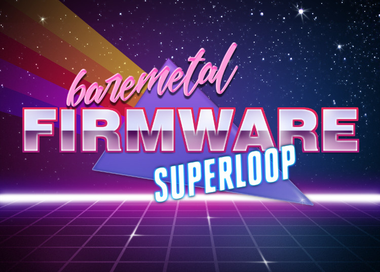

# Jarnax



A Super-loop embedded system re-imagined in, at _least_, C++20 and _only_ in C++, on the Cortex M4 architecture. Some minor assembly is unavoidable due to the architecture but C++ standards are still followed with assembly usage.

## Purpose

To write a safety oriented (MISRA 23 adjacent) Cortex-M bare-metal system in C++20 or later, with no `C` baggage. This means things like:

* No `C` casts when casting is needed.
* No `#defines`, including macros. Instead replaced with `inline`d code, `using`s and other C++-isms like `constexpr` and `consteval`.
* No `CMSIS`. The Cortex System Structures are all defined locally as C++ bit-fields with the proper types _built in_ mainly using inspiration from the [peripheralyzer](https://github.com/emrainey/peripheralyzer) project.
* No dependence on "manual" linking. This means when the address of some hardware peripheral is required, the _linker_ is the tool which assigns a symbol to it, not the C++ code. This pattern allows the unit test framework to be completely cross 32/64 pointer agnostic.
* Unit Test Oriented Development. Many parts of low level firmware are eminently testable given the right environment. The guidelines above make it much simplier to do so. When choosing between being behavior focused (clean API) or implementation focused, the default should be behavior focused.

This bare-metal firmware also does not permit several C++ features in order to reduce failure modes (at a cost):

* No C++ exceptions (we look forward to memory safe exceptions!)
* No C++ RTTI (Run Time Type Information)
* No `dynamic_cast`, use as few `reinterpret_cast` as possible, favoring to get types correct first. Wheneven it is needed it should be used sparingly and in an extensible way to encourage wide use (and thus situational coverage).
* No dynamic memory allocation except where absolutely unavoidable. When it is absolutely unavoidable, prefer to allocate at initialization time and not "in the moment".

Using the plain STL or libc with these features turned "off" is challenging and leads to hard-to-meet expectations about which structures or templates or related features will work or when those will sneakily do the wrong thing.

Which common types won't work usually comes down to objects which are resizable at runtime or so heavily depend on exceptions that you practically have to reinvent them to have a usable API.

* `std::vector` - resizeable at runtime and uses exceptions to communicate failures (even when a simple bool would have worked).
* `std::bind` - sometimes allocates, sometimes doesn't, it's roulette!
* `std::string` - also sometime an allocation roulette!

In order to fill the _need_ that the _STL_ or other template libraries provide, this project seeks to implement a bare-minimum number of templates to function (mainly because these are fun to implement and test, not that there are no choices out there).

* `Span`
* `Array`
* `Ring`
* `Stack`
* `Container`
* `Pool`
* `etc..`

Additionally the design of the firmware is generally

* A single thread of execution, the Super-Loop. This means a single `while(true)` loop is permitted, in `main` and no where else.
* A bare minimum number of interrupts are enabled.
* When a peripheral is used, prefer a DMA driven design first, then ISR, then polled. A very specific design choice should drive this. We _understand_ that DMA is not free, but it is generally conceivable to prioritize.
* Asynchronous and non-blocking functions in all interfaces
* Client facing service use Pure Virtual Interfaces to communicate interface and expectations. Application use those Pure Virtual interfaces to remain (to some degree) separated from the details of the implementation and remain (somewhat) abstract.
* When the need for the complexity arrives, StateCharts or State Machines are employed to control the state of some internal hardware or external chip, parser, standard or some gestalt thereof. Use the given templates or better yet, use a 3rd party tool which generates the code _directly_ from the diagrams such as [StateSmith](https://github.com/StateSmith/StateSmith) or itemis' CREATE (previously Yakindu), or Ansys tools or one of many others. Design in good boundary interfaces and Unit Test those State Machines.
* In a deviation from common portability norms, this project relies on the platform dependent implementation detail of _bitfields_ and _unions_ to implement easy to use _MACRO_-less  and cast-less peripheral interfaces. The `peripheralyzer` project provides some generated tests which then can enforce compliance.

## Documentation

* <https://www.st.com/en/microcontrollers-microprocessors/stm32f407ve.html>
* <https://wiki.segger.com/J-Link_GDB_Server>

## Links

* <https://interrupt.memfault.com/blog/arm-cortex-m-exceptions-and-nvic#exception-entry--exit>
* <https://www.eng.auburn.edu/~nelson/courses/elec5260_6260/slides/ARM%20STM32F476%20Interrupts.pdf>
* <https://microcontrollerslab.com/nested-vectored-interrupt-controller-nvic-arm-cortex-m/>
* <https://interrupt.memfault.com/blog/arm-cortex-m-exceptions-and-nvic>
* <https://mcuoneclipse.com/2016/10/17/tutorial-using-single-wire-output-swo-with-arm-cortex-m-and-eclipse/>
* <https://maskray.me/blog/2021-11-07-init-ctors-init-array>

## Renode

Renode is a (not nearly complete enough) emulation of the Cortex M series and it has a _board_ emulation of the Segger TRB (STM32F407VE). Typically this is used by other system to emulate for testing purposes. Renode's emulation is missing some features like ITM/TPIU and SWO and Ticks and a bunch of other stuff.

* <https://interrupt.memfault.com/blog/intro-to-renode>
* <https://zephyr-dashboard.renode.io/renodepedia/boards/segger_trb_stm32f407/?view=hardware&demo=Hello_World>

## QEMU

TBD

## Building

Visual Studio Code should be able to run this and identify the presets configuration. However you can also use the command line.

```bash
# After installing arm-none-eabi-gcc via mac pkg
$ export PATH=$PATH:/Application/ARM/bin
$ cmake --list-presets
Available configure presets:

  "cortex-gcc-arm-none-eabi-10" - GCC ARM None EABI 10 for Cortex-M
  "cortex-gcc-arm-none-eabi-11" - GCC ARM None EABI 11 for Cortex-M
  "cortex-gcc-arm-none-eabi-12" - GCC ARM None EABI 12 for Cortex-M
  "cortex-gcc-arm-none-eabi-13" - GCC ARM None EABI 13 for Cortex-M
  "native-gcc-11"               - Homebrew GCC 11
  "native-gcc-12"               - Homebrew GCC 12
  "native-gcc-13"               - Homebrew GCC 13
  "native-llvm-19"              - LLVM 19.1.7_1
  "native-clang"                - Native Clang Toolchain
$ cmake --preset cortex-gcc-arm-none-eabi-13 -B build/stm32-gcc-arm-none-eabi-13 -S .
$ cmake --build build/cortex-gcc-arm-none-eabi-13
# Or Run the Whole Workflow
$ cmake --workflow --list-presets
Available workflow presets:

  "on-target-gcc-10"
  "on-target-gcc-11"
  "on-target-gcc-12"
  "on-target-gcc-13"
  "unit-tests-gcc-11"
  "unit-tests-gcc-12"
  "unit-tests-gcc-13"
  "unit-tests-llvm-19"
  "unit-tests-clang"
$ cmake --workflow --preset unit-tests-clang"
```

## Debug

```bash
# in one window
./scripts/debug.sh renode
# or if yu have a JLink
./scripts/debug.sh server

# in another terminal
# modify ./scripts/stm32f407ve.gdb for commands as needed
./scripts/debug.sh client
```

## Modules

Components are separated into modules which are independent and require build support to interwork. This is done to prevent accidental inclusion in single `include/` folder systems for all components. After a dependency is formed in the build system, the appropriate include paths, defines, sources, etc. will be provided.

```text
modules/
  core/   - Simple Template Library, common Status object.
  cortex/ - Cortex M Architecture Support
  jarnax/ - System Library with SuperLoop, Interfaces
  memory/ - Generic Memory Library
  native/ - Native Board build for unit testing
  segger/ - Segger debugging library (RTT)
  stm32/  - STM32 Vendor Board definitions
```

### Build `modules`

As this experiment moves towards a C++20 module build, the code and the artifacts have already been spliced into various libraries which have dependencies on the layers of configuration.

#### Configuration

There are two layers of configuration. System and Board Level. Some modules depend on none, one or both of these sets of configuration.

##### System Configuration

This configuration sets high level feature switches and constants which do not directly depend on the hardware on which is runs (generally). Typically this will be something like enabling some high level feature or some debug setting. In the build the list of all system configurations is referred to as `LOCAL_CONFIGURATIONS`.

##### Board Level Configuration

This configuration is low level and contains things which are board specific which are also processor specific. Chip addresses, GPIO configurations, etc are considered at this layer. In the build, the list of supported board configurations is referred to as `LOCAL_BOARDS`.

##### Modules and their dependencies

For example, the `memory` module doesn't depend on either board level or system level configuration. This has an effect on the module (static library) name generated. When a module doesn't depend on a system configuration it's marked with the `none` name. When a module doesn't depend on a specific board configuration it's marked with the `all` name. Thus, `memory-none-all.a` is the output name for the module.

When a module _does_ depend on either configuration, it's name is incorporated into the name of the module artifact. `jarnax` module for example is built for a specific system configuration and it must know about the board it runs on, thus it's artifact name follows the convention of `<module>-<system-cfg>-<board-cfg>.a` or in a specific case, `jarnax-basic-stm32_f4ve_v2.a`. This module depends on the system level configuration named `basic` and the board configuration for the `stm32_f4ve_v2` board.

Applications also follow this pattern, but with a slight variation. Applications have names which may have further variations in the stem.

```text
<application>-<system-cfg>-<board-cfg>.elf
Where
<application> may break down into <name>-<app-cfg>.
```

### System

System Components and interfaces live in the `jarnax` library and namespace. Generally it's header files and interfaces live in `include/jarnax` and are used by Applications. System source is built in the `modules/jarnax/source/`

Layout:

* `modules/`
  * `jarnax/`
    * `include/system` - only path to `include` is made as a dependency
    * `source/*.cpp`

## Drivers

Chip specific drivers live in the vendor specific namespace like `stm32`. These internal driver headers will also be in an `include/stm32` subfolder.

* `modules/`
  * `stm32/`
    * `include/stm32` - only path to `include` is made as a dependency
    * `source/*.cpp`

## Supported Boards

The first board supported is the `stm32_f4ve_v2` board. The STM32F4VE has the following high level diagram supporting many peripherals (taken from the PDF from ST Electronics, not mine).


### Linkerscripts

Each vendor will contain it's own version of the linker script under `<vendor>/linkerscripts/<compiler>.ld`. As architectures or variation are added, it may be necessary to build a hierarchy but not yet. Generally the pattern followed in the linkerscript is to explicitly assign address to hardware peripherals here and _only_ here, so that unit tests never have to have `#ifdef`s to know if they are referencing 32 bit pointer or a 64 bit pointers and to that Drivers never worry about uninitialized pointers.

```text
    /* Arm Private Bus 1 */
    .apb1 (NOLOAD) : {
        . = ORIGIN(APB1) + 0x0000;
        _stm32_tim2 = . ;
        . = ORIGIN(APB1) + 0x0400;
...
    PROVIDE(_ZN5stm329registers6timer2E = _stm32_tim2);
```

This is the gcc linkerscript so it follows gcc name mangling. Then in the C++ code we simply declare that the timer2 exists `extern`.

```c++
namespace stm32 {
namespace registers {
/// The external volatile tim2 which is a memory mapped register or peripheral.
/// @note The address of the peripheral is set either by the linkerscript or by a unit test.
extern Timer2 volatile timer2;
}    // namespace registers
}    // namespace stm32
```

Thus only the memory map in the linker needs to know it's real address. If it needs to be known in code, we simply refer to it naturally as `&stm32::registers::timer2`.

## Things To Do

```text
[ ] Pick a better name than _jarnax_ (first word that popped into my mind)
  [x] bare-metal firmware = bmf
  [ ] bare-metal firmware super loop = bmfsl
  [x] embedded-superloop = esl
[x] Modern CMake INTERFACE libraries
[x] Modern CMake Preset Build
[x] Encapsulate Firmware Build in a CMake Function
[x] Separate Cortex flags from Strict flags from Firmware options in CMake.
[x] Group System things in `system`
[x] Group THUMB specialty instructions in `always_inline` C++ header and `thumb::` namespace
[x] Group Cortex related code into `cortex::` namespace
[x] Group Core C++ Template Classes into `core::` namespace
[x] Organize headers better (<name>/<namespace>.hpp cascade includes whole namespace)
[x] Separate most functions into separate .cpp files
[x] Write `reset_entry` into C++ code
[x] Write vector table entries
[x] Write basic linker script w/ backup ram for fun
[x] Add basic Cortex M series headers.
[x] Zero Initialize BSS
[x] Load from ReadOnly Flash section into Globals
[x] Verify Global Data Values (like clock_frequency)
[x] Generate Linker Map w/ Cross Reference (in CMake)
[x] Generate Disassembly of Firmware (in build.sh)
[x] Call the __preinit_array and__init_array functions which GCC adds
[x] Make all headers .hpp
[x] Verify that a constructor was called. <- Requires a complex constructible object
[x] Implement `memset` to appease GCC during `-O1` w/ `-nostdlib`
[x] Implement a cortex register based external reset request and test it.
[x] Implement `Span`
[x] Implement `Array`
[x] Implement `Ring`
[x] Implement `Stack`
[ ] Implement `List` (what am I counting here as a List?)
[x] Implement 'Split' - for a variable bit split (upper/lower)
[x] Implement DoubleLink Node for Executables
[ ] Implement Iterators in Span/Array/Ring/Stack/List
[x] Implement Unit Test for Span in an Application
[x] Implement Unit Test for Array in an Application
[x] Implement Unit Test for Ring in an Application
[x] Implement Unit Test for Stack in an Application
[ ] Implement Unit Test for List in an Application
[ ] Implement Unit Test for Split in an Application
[x] Replace for() loops with `for(auto .:..)`
[x] Complete generic boot sequence (up to enabling interrupts)
[x] Enable MPU w/ simple mapping from linker (duplicated? or pulled from linker script itself?)
[ ] Split Vendor MPU Settings from System MPU settings (call vendor from system)
[ ] Enable SWO/ITM/TPIU (mostly)
[ ] Capture SWO output
[x] Enable VSCode launch.json for debugging
[x] Move the "configure.hpp" to each app so they can configure the firmware build.
[x] Make all Register volatile and placed by the linkerscript at the right addresses, no #defines or casts needed.
[x] Add System Tick float unit (1/128th or 1/256th or more, not less) to configuration.
[x] Enable System Tick - but do not use a power of 10 base, use a power of 2 base. Time can be more easily represented in powers of 2 in floats.  1/128 (0.0078125 or ~8ms) or 1/256 (0.00390625 or ~4ms).system configuration issue.
[ ] Implement Unit Test for System Tick in an Application
[x] Enabled choosing MSP or PSP at boot along with other Cortex M modes.
[x] Write up the Interrupt Structures from Cortex Manual
[ ] Self Test at Boot which triggers and captures all Interrupt Modes before going to main. In BootSelfTest mode, the handler will return correctly to exterior code.
[ ] Implement Data Cache and Instruction Cache operations (for real)
[ ] Replace all Fault Register Definitions from CMSIS
[x] Capture a Non Maskable Interrupt in Ozone
[ ] Process the NMI as what? yield?
[ ] Capture a Hard Fault in Ozone
[ ] Process a Hard Fault (if BIST, return, else?)
[ ] Capture a Memory Management Fault in Ozone
[ ] Process a Memory Management Fault (if BIST, return, else?)
[ ] Capture a Usage Fault in Ozone
[ ] Process a Usage Fault (if BIST, return, else?)
[x] Capture a SVC Call in Ozone
[x] Trigger SVC Call (w/ parameters?)
[x] Return a value back from SVC
[ ] Write compact handler entry/exit in assembler? `asm()` version leaks registers here and there.
[ ] Capture a PendSV Call
[ ] Capture an External Fault -> requires a different board? Renode?
[x] Setup the Privilege vs. User mode function (sets MSP/PSP then jump)
[x] Implement the Microsecond Timer
[x] Implement running in User mode vs. Privileged mode via `jarnax::run_in_privileged_mode_only`
[ ] Implement a STM32F407VE SPI Driver
[ ] Implement the Winbond SPI Flash Driver W25Q16
[ ] Implement a LSM9DS1 IMU Driver (spi based?)
[x] Add a .clang_format
[x] Add a .clang-tidy
[x] Add doxygen everywhere
[x] Generate doxygen in CMake
[x] Learn how to run in Renode in a Container
[x] Run in Renode (takes forever to start)
[x] Create VSCode cmake variant file
[ ] Generate Coverage in Renode
[ ] Determinstic builds (ld GUID removal, no __FILE__)
[x] Add disassembly target to build.
[ ] Verify all System Linker Register addresses in an On Target Unit Test
```
